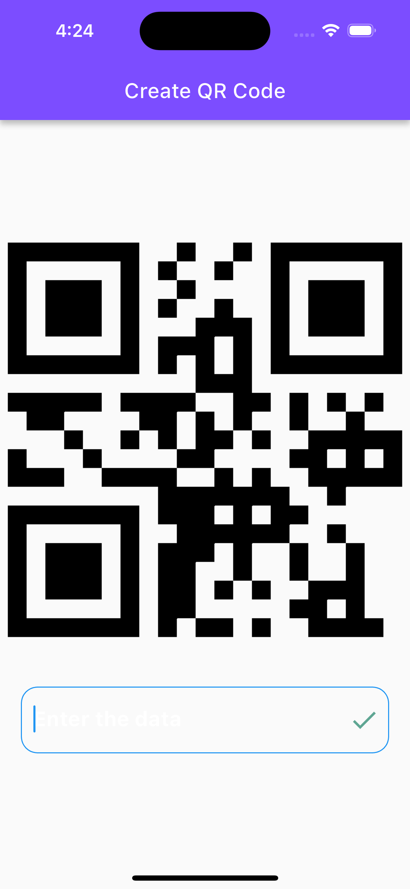

# qrcode

A new Flutter project.

## Getting Started

This project is a starting point for a Flutter application.

A few resources to get you started if this is your first Flutter project:

- [Lab: Write your first Flutter app](https://docs.flutter.dev/get-started/codelab)
- [Cookbook: Useful Flutter samples](https://docs.flutter.dev/cookbook)

For help getting started with Flutter development, view the
[online documentation](https://docs.flutter.dev/), which offers tutorials,
samples, guidance on mobile development, and a full API reference.
# Flutter-QrCode

# QR Kodu Oluşturucu

Bu, Flutter ile geliştirilmiş basit bir QR kodu oluşturucu mini uygulamasıdır. Bu uygulama sayesinde metin veya bağlantıları QR kodlarına dönüştürebilir ve bunları paylaşabilirsiniz.

## Ekran Görüntüleri

## Özellikler

- Metin veya bağlantıları QR kodlarına dönüştürme
- QR kodlarını paylaşma seçeneği
- Basit ve kullanıcı dostu arayüz

## Kurulum

1. Bu depoyu klonlayın veya ZIP olarak indirin.

2. Proje dizinine gidin:

