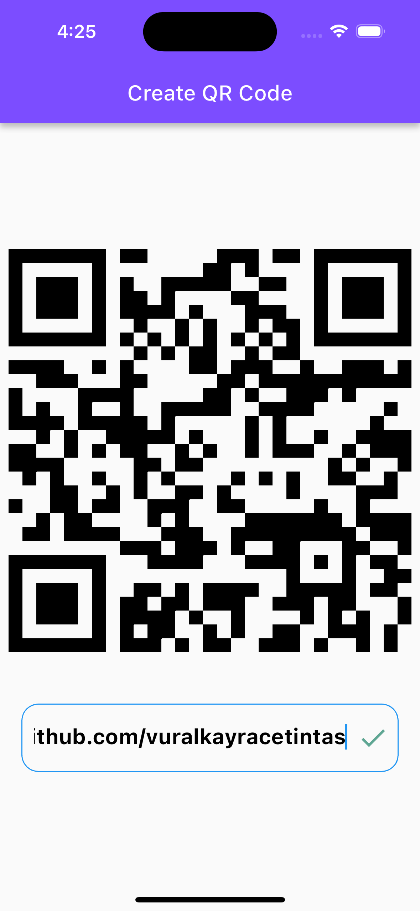

QRCODE 

This is a simple QR code generator developed with Flutter.

Screenshots

- [App Video](https://www.youtube.com/shorts/sfpKA2_3SYg)

## Features
Conversion of text or URLs to QR codes
Simple and user-friendly interface

Bu, Flutter ile geliştirilmiş basit bir QR kodu oluşturucudur.

## Ekran Görüntüleri

- [Uygulama Goruntusu](https://www.youtube.com/shorts/sfpKA2_3SYg)

## Özellikler

- Metin veya bağlantıları QR kodlarına dönüştürme
- Basit ve kullanıcı dostu arayüz

